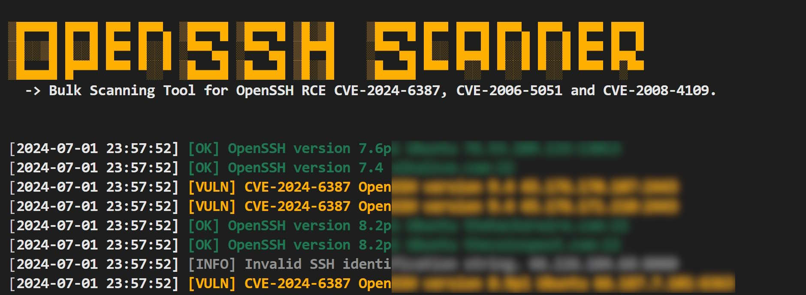

# OpenSSH-Scanner
OpenSSH Vulnerabilities Scanner: Bulk Scanning Tool for 21 different OpenSSH CVEs.



## Overview
This Python script is a comprehensive vulnerability scanner for OpenSSH, designed to detect multiple CVEs across various OpenSSH versions. It supports bulk scanning and can detect vulnerabilities including CVE-2024-6387, CVE-2024-6409, and 19 other CVEs affecting OpenSSH versions ranging from 2.3.0 to 9.7.

## Key Features

- Scans for 21 different OpenSSH CVEs
- Supports bulk scanning from a file and single IP scanning
- Flexible target specification: IP:PORT or IP (defaulting to port 22)
- Multi-threaded for improved performance
- Configurable thread count
- Multiple output formats: TXT, JSON, CSV
- Detailed logging and color-coded console output
- Version-based vulnerability detection

## Version 1.0.4

### Supported CVEs:
```sh
- CVE-2024-6387: Affects OpenSSH versions 8.5 to 9.7.
- CVE-2019-6111: Affects OpenSSH versions 5.6 to 7.9.
- CVE-2018-15473: Affects OpenSSH version 7.7.
- CVE-2016-10012: Affects OpenSSH version 6.9.
- CVE-2016-10009: Affects OpenSSH version 7.2.
- CVE-2016-6210: Affects OpenSSH version 7.2.
- CVE-2016-3115: Affects OpenSSH version 7.1.
- CVE-2016-0777: Affects OpenSSH versions 5.4 to 7.1.
- CVE-2015-6564: Affects OpenSSH version 7.0.
- CVE-2015-6563: Affects OpenSSH version 6.8.
- CVE-2015-5600: Affects OpenSSH versions 6.8 and 6.9.
- CVE-2014-2532: Affects OpenSSH version 6.6.
- CVE-2013-4548: Affects OpenSSH version 6.2.
- CVE-2012-0814: Affects OpenSSH version 6.1.
- CVE-2012-0816: Affects OpenSSH version 6.0.
- CVE-2008-5161: Affects OpenSSH version 5.0.
- CVE-2006-5051 and CVE-2008-4109: Affects OpenSSH versions before 4.4.
- CVE-2003-0190: Affects OpenSSH versions before 3.7.1p2.
- CVE-2002-0083: Affects OpenSSH versions before 3.1.
- CVE-2001-0817: Affects OpenSSH versions before 2.3.0.
```

## Usage
```sh
- `-f`: File containing list of targets
- `-u`: Single target (IP or IP:port)
- `--output`: Output file to save results
- `-t`: Number of threads (default: 3)
- `--format`: Output format (txt, json, csv)
```

## Usage Examples

### 1. Scanning a single target
```bash
python ssh.py -u 192.168.1.100
```
### Example output:
```bash
[2024-08-25 10:15:23] [OK] 192.168.1.100:22 - OpenSSH_8.2p1 Ubuntu-4ubuntu0.5 - Not Vulnerable
```

### 2. Scanning multiple targets from a file
Create a file named targets.txt with target IPs, for example:
```bash
192.168.1.101
192.168.1.102:2222
192.168.1.103
```
Then run:
```bash
python ssh.py -f targets.txt --output results.txt -t 3
```
### Example output:
```bash
[2024-08-25 10:16:05] [VULN] 192.168.1.101:22 - OpenSSH_7.5p1 Debian-10+deb9u1 - CVE-2018-15473
[2024-08-25 10:16:06] [ERROR] 192.168.1.102:2222 - Connection refused
[2024-08-25 10:16:07] [OK] 192.168.1.103:22 - OpenSSH_8.9p1 Ubuntu-3ubuntu0.1 - Not Vulnerable
```

### 3. Scanning with JSON output
```sh
python ssh.py -f targets.txt --output results.json --format json -t 4
```
### Example results.json
```sh
[
    {
        "timestamp": "2024-08-25 10:17:30",
        "level": "VULN",
        "message": "192.168.1.101:22 - OpenSSH_7.5p1 Debian-10+deb9u1 - CVE-2018-15473"
    },
    {
        "timestamp": "2024-08-25 10:17:31",
        "level": "ERROR",
        "message": "192.168.1.102:2222 - Connection refused"
    },
    {
        "timestamp": "2024-08-25 10:17:32",
        "level": "OK",
        "message": "192.168.1.103:22 - OpenSSH_8.9p1 Ubuntu-3ubuntu0.1 - Not Vulnerable"
    }
]
```

### 4. Scanning with CSV output
```sh
python ssh.py -f targets.txt --output results.csv --format csv -t 4
```
### Example results.csv
```sh
Timestamp,Level,Message
2024-08-25 10:18:45,VULN,192.168.1.101:22 - OpenSSH_7.5p1 Debian-10+deb9u1 - CVE-2018-15473
2024-08-25 10:18:46,ERROR,192.168.1.102:2222 - Connection refused
2024-08-25 10:18:47,OK,192.168.1.103:22 - OpenSSH_8.9p1 Ubuntu-3ubuntu0.1 - Not Vulnerable
```

## Contact

For any suggestions or thoughts, please get in touch with [me](https://x.com/MohamedNab1l).


## Disclaimer

This provided tool is for educational purposes only. I do not encourage, condone, or support unauthorized access to any system or network. Use this tool responsibly and only on systems you have explicit permission to test. Any actions and consequences resulting from misuse of this tool are your own responsibility.

